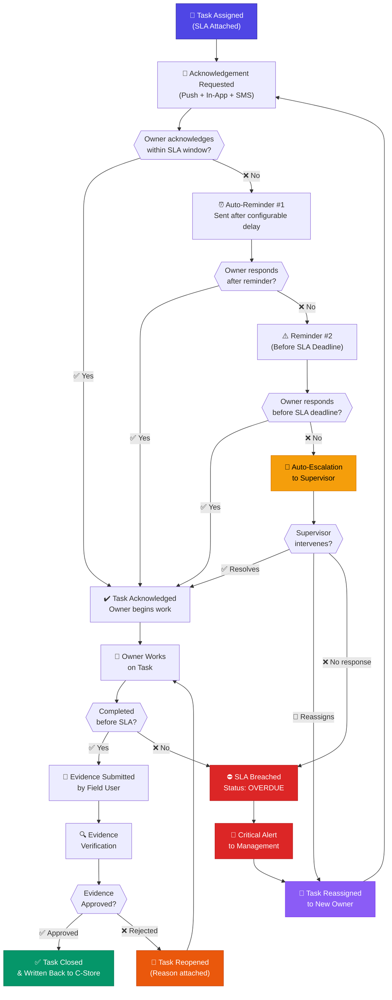
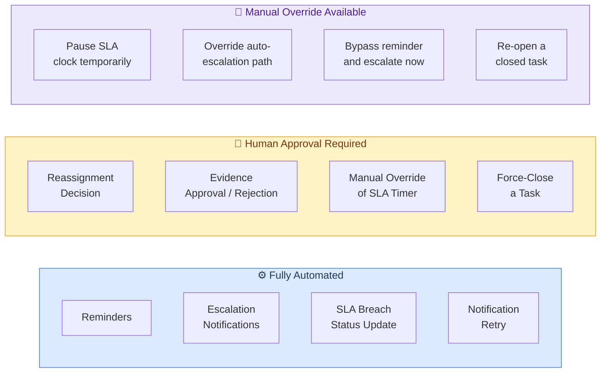
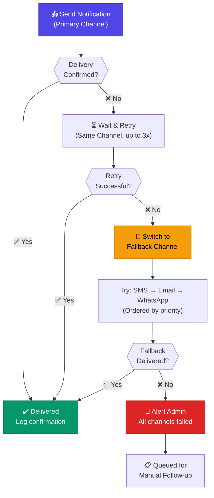
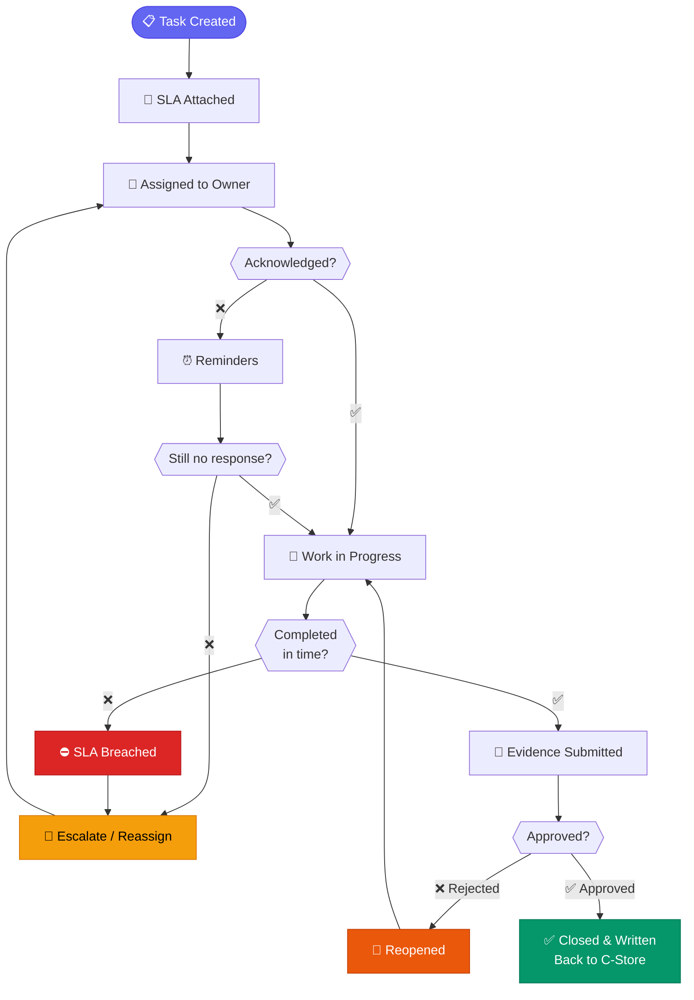

# Exception Management Flow — What Happens If the Task Is Not Completed?

> [!IMPORTANT]
> This section addresses the gap between **"SLA attached"** and **"Closed & written back to C‑Store"** — specifically, the enforcement loop that ensures every assigned task is either completed or properly escalated.

---

## Overview

Once a task is assigned and an SLA is attached, the system does **not** assume the owner will act. Instead, it enters an **active enforcement loop** that tracks acknowledgement, reminds, escalates, and — if necessary — reassigns the task until it reaches verified closure.

### High-Level Exception Flow

```
Assigned → Awaiting Acknowledgement → Reminder → Escalation → Reassignment
    → Evidence Submission → Verification → Closure & Write-back
```

---

## Detailed Exception-Management Flow



---

## Stage-by-Stage Breakdown

### 1. Task Assigned & Acknowledgement Requested

| Detail | Value |
|---|---|
| **Trigger** | Task created and SLA attached |
| **Action** | System sends acknowledgement request via Push, In-App, and SMS |
| **Expected Response** | Owner taps "Acknowledge" within configurable window (e.g. 30 min) |
| **Data Logged** | Timestamp of assignment, channels used, delivery status |

---

### 2. Automatic Reminder (No Acknowledgement)

| Detail | Value |
|---|---|
| **Trigger** | Owner does not acknowledge within the first window |
| **Action** | System sends Reminder #1 automatically |
| **Channels** | Same channels + fallback channel if primary delivery failed |
| **Timing** | Configurable (e.g. 1 hour after assignment) |

> [!TIP]
> A second reminder is sent **before the SLA deadline** to give the owner a final opportunity to act.

---

### 3. Automatic Escalation to Supervisor

| Detail | Value |
|---|---|
| **Trigger** | Owner does not respond after Reminder #2 |
| **Action** | Task auto-escalated to the owner's supervisor |
| **Supervisor Options** | Resolve directly, reassign to another user, or flag for management |
| **Data Logged** | Escalation timestamp, supervisor notified, supervisor action taken |

---

### 4. Reassignment

| Detail | Value |
|---|---|
| **Trigger** | Supervisor reassigns, or owner is marked unavailable |
| **Action** | Task transferred to a new owner; acknowledgement loop restarts |
| **Rules** | System can auto-suggest available team members based on workload and skills |
| **Data Logged** | Reassignment reason, previous owner, new owner |

---

### 5. Overdue / SLA Breached

| Detail | Value |
|---|---|
| **Trigger** | SLA deadline passes with no completion or acknowledgement |
| **Status** | Task marked as **OVERDUE / SLA BREACHED** |
| **Action** | Critical alert sent to management; task remains active until resolved |
| **Impact** | Reflected in SLA compliance dashboards and KPI reporting |

---

### 6. Evidence Submission & Verification

| Detail | Value |
|---|---|
| **Trigger** | Owner marks task as complete |
| **Action** | Field user uploads evidence (photos, signatures, forms) |
| **Verification** | Evidence reviewed — either **Approved** or **Rejected** |
| **If Rejected** | Task **reopened** with rejection reason; owner must resubmit |
| **If Approved** | Task **closed** and written back to C‑Store |

---

## Human Approval & Manual Override

Some actions in this flow require or allow **human intervention**. The diagram below shows which steps can be automated vs. which require manual approval.



> [!WARNING]
> **Force-closing** a task or **overriding the SLA timer** are audited actions. Every manual override is logged with the operator's identity, timestamp, and justification.

---

## Failed Notification Retry Flow

When a notification fails to deliver (e.g. push not received, SMS gateway error), the system automatically retries through an alternative channel.



| Retry Rule | Details |
|---|---|
| **Max retries per channel** | 3 attempts with exponential backoff |
| **Fallback order** | SMS → Email → WhatsApp (configurable) |
| **All channels exhausted** | Admin alerted; task queued for manual follow-up |
| **Logging** | Every attempt logged with channel, timestamp, and status |

---

## Summary: Complete Task Lifecycle (Happy Path + Exception Path)



> [!NOTE]
> This flow ensures **no task falls through the cracks**. Every unacknowledged, stalled, or failed task is automatically escalated until a human resolves it — with full audit logging at every step.
